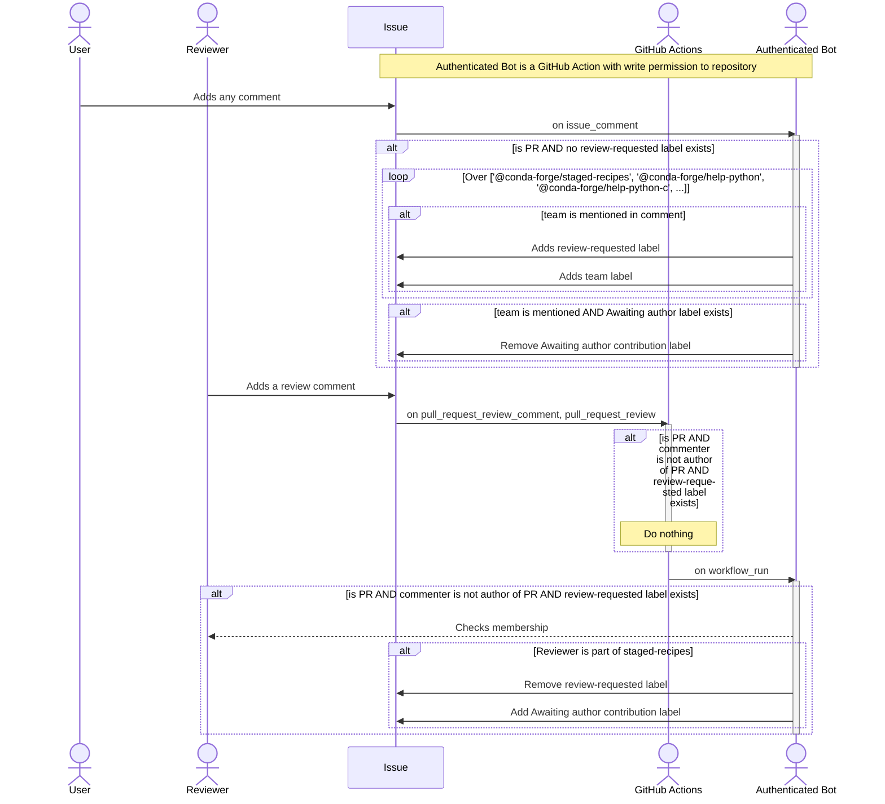
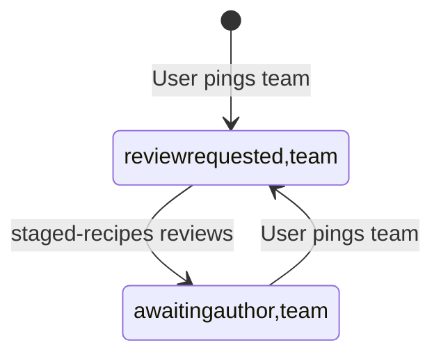

# test-labeler

Test the conda-forge/staged-recipes actions.

## Workflow

```mermaid
sequenceDiagram
    actor User
    actor Reviewer
    participant Issue
    actor GitHub Actions
    actor Authenticated Bot
    Note over Authenticated Bot,Issue: Authenticated Bot is a GitHub Action with write permission to repository

    User->>Issue: Adds any comment
    Issue->>Authenticated Bot: on issue_comment

    activate Authenticated Bot
    alt is PR AND no review-requested label exists
        loop Over ['@conda-forge/staged-recipes', '@conda-forge/help-python', '@conda-forge/help-python-c', ...]
            alt team is mentioned in comment
                Authenticated Bot->>Issue: Adds review-requested label
                Authenticated Bot->>Issue: Adds team label
            end
        end
        alt team is mentioned AND Awaiting author label exists
                Authenticated Bot->>Issue: Remove Awaiting author contribution label
        end

    end
    deactivate Authenticated Bot
    Reviewer->>Issue: Adds a review comment
    Issue->>GitHub Actions: on pull_request_review_comment, pull_request_review
    activate GitHub Actions
    alt is PR AND commenter is not author of PR AND review-requested label exists
        Note over GitHub Actions: Do nothing
    end
    deactivate GitHub Actions
    GitHub Actions->>Authenticated Bot: on workflow_run
    activate Authenticated Bot
    alt is PR AND commenter is not author of PR AND review-requested label exists
        Authenticated Bot-->>Reviewer: Checks membership
        alt Reviewer is part of staged-recipes
            Authenticated Bot->>Issue: Remove review-requested label
            Authenticated Bot->>Issue: Add Awaiting author contribution label
        end
    end
    deactivate Authenticated Bot
```

_Note_: The blue part is proposed and not actually integrated yet.

## Label State Diagram

```mermaid
stateDiagram-v2
    [*] --> reviewrequested,team: User pings team
    reviewrequested,team --> awaitingauthor,team: staged-recipes reviews
    awaitingauthor,team --> reviewrequested,team: User pings team
```
